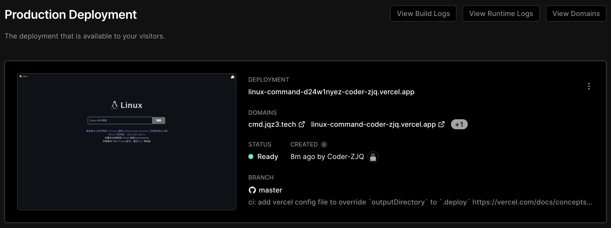

<p align="center">
  <a href="https://jaywcjlove.github.io/linux-command">
    
  </a>
  <h1>Linux Command</h1>
</p>


## Docker

[](https://hub.docker.com/r/wcjiang/linux-command) [](https://hub.docker.com/r/wcjiang/linux-command) [](https://hub.docker.com/r/wcjiang/linux-command)

Easily deploy linux-command website via docker.

```bash
docker pull wcjiang/linux-command
# Or
docker pull ghcr.io/theriturajps/Linux-Command:latest
```

```bash
docker run --name linux-command --rm -d -p 9665:3000 wcjiang/linux-command:latest
# Or
docker run --name linux-command -itd -p 9665:3000 wcjiang/linux-command:latest
# Or
docker run --name linux-command -itd -p 9665:3000 ghcr.io/theriturajps/Linux-Command:latest
```

Visit the following URL in your browser

```bash
http://localhost:9665/
```

## Vercel

You can click the button below to deploy to [Vercel](https://vercel.com) with one click:

[](https://vercel.com/new/clone?repository-url=https://github.com/theriturajps/Linux-Command)

<details>
<summary>Deployment results</summary>



</details>

## Development and use

The [`linux-command`](https://www.npmjs.com/package/linux-command) package can be installed through `npm`, which contains the markdown text of all commands, and an [index file](dist/data. json).

```bash
npm install linux-command
```

```js
var comm = require("linux-command");
console.log("---->", comm.ls);

var alias = require("linux-command/command/alias.md");
console.log("---->", alias); // markdown string
```

You can also access index data and corresponding command details through CDN. I will update the content regularly and release versions for everyone to use. [UNPKG](https://unpkg.com/linux-command/) Bring the version number , version access will be locked, version number request data will be deleted, and the latest version will be automatically redirected.

```shell
# Command index JSON data
https://unpkg.com/linux-command/dist/data.json
# Corresponding command details (Markdown) data
https://unpkg.com/linux-command/command/<command name>.md
```

You can also get the latest content through Github's Raw

```shell
# Command index JSON data
https://raw.githubusercontent.com/theriturajps/Linux-Command/master/dist/data.json
# Corresponding command details (Markdown) data
https://raw.githubusercontent.com/theriturajps/Linux-Command/master/command/<command name>.md
```

## Thanks to all contributors

As always, thank you to our amazing contributors!

<!--AUTO_GENERATED_PLEASE_DONT_DELETE_IT--><a href="https://github.com/jaywcjlove" title="Little Brother Diaotiao">
   
</a>
<a href="https://github.com/ZhuangZhu-74" title="ZhuangZhu-74">
   
</a><!--AUTO_GENERATED_PLEASE_DONT_DELETE_IT-END-->

Contributor list, automatically generated by [contributors](https://github.com/jaywcjlove/github-action-contributors)

## License

Licensed under the MIT License.
